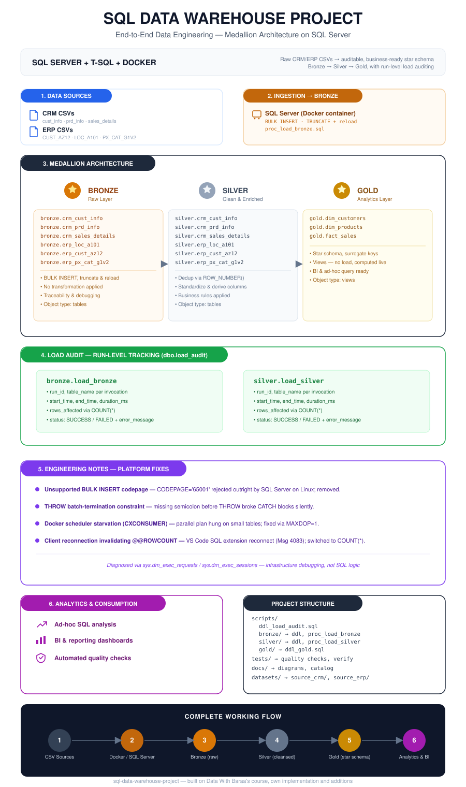

# SQL Data Warehouse Project

A Medallion-architecture data warehouse on Microsoft SQL Server — Bronze, Silver, and Gold layers taking raw CRM/ERP CSV extracts through ingestion, cleansing, and dimensional modeling into an analytics-ready star schema. Implemented and validated end-to-end on SQL Server for Linux via Docker on macOS, including diagnosis and resolution of three platform-specific defects the Windows-targeted original never surfaced.

> **macOS + Docker:** see [MAC_DOCKER_SETUP.md](MAC_DOCKER_SETUP.md) for the containerized build and run procedure.

> **Companion project:** [SQL Data Analytics Project](https://github.com/vishal1215/sql-data-analytics-project) — exploratory analysis, segmentation, and reporting built on top of the Gold-layer star schema produced here.

---
## 🖼️ Project at a Glance



---
## 🏗️ Data Architecture

Three-layer Medallion pattern — each layer a distinct trust and transformation boundary:


See also: [docs/data_flow.svg](docs/data_flow.svg) (table-level lineage) and [docs/data_model.svg](docs/data_model.svg) (Gold-layer star schema).

1. **Bronze** — Raw ingestion layer. Source CSVs land as-is via `BULK INSERT`, full truncate-and-reload per run. No transformation, no schema enforcement beyond typing — traceability and reproducibility are the design goals here, not cleanliness.
2. **Silver** — Cleansed and conformed layer. Deduplication (`ROW_NUMBER()` windowing on the latest record per business key), type normalization, categorical standardization, and derived columns (e.g. product `prd_end_dt` inferred via `LEAD()` over the effective-dating window).
3. **Gold** — Consumption layer. A denormalized star schema exposed as views — one fact table (`fact_sales`) against two conformed dimensions (`dim_customers`, `dim_products`) on surrogate keys — optimized for downstream BI and ad-hoc analytical querying.

---
## 📖 Project Scope

1. **Data Architecture** — Medallion-pattern warehouse design with explicit layer boundaries and single-responsibility transformations per stage.
2. **ETL Pipelines** — idempotent, re-runnable extract/load procedures with structured error handling and execution auditing (see *Engineering Additions* below).
3. **Dimensional Modeling** — star-schema fact/dimension design with surrogate key generation via `ROW_NUMBER()`.
4. **Data Quality Assurance** — automated referential-integrity and uniqueness assertions run post-load, independent of the load procedures themselves.

### Specifications
- **Source systems**: CRM and ERP, delivered as flat CSV extracts.
- **Data quality**: cleansing, standardization, and validation handled in Silver; assertions enforced in `tests/`.
- **Integration**: both source systems conformed into a single analytical model on shared business keys.
- **Scope**: current-state snapshot only — historization (SCD) was explicitly out of scope for this iteration.

---

## 🚀 Build & Execution Order

Full containerized walkthrough in [MAC_DOCKER_SETUP.md](MAC_DOCKER_SETUP.md). Execution sequence:

1. `scripts/init_database.sql`
2. `scripts/ddl_load_audit.sql`
3. `scripts/bronze/ddl_bronze.sql`
4. `scripts/bronze/proc_load_bronze.sql`, then `EXEC bronze.load_bronze;`
5. `scripts/silver/ddl_silver.sql`
6. `scripts/silver/proc_load_silver.sql`, then `EXEC silver.load_silver;`
7. `tests/quality_checks_silver.sql`
8. `scripts/gold/ddl_gold.sql`
9. `tests/quality_checks_gold.sql`
10. `tests/setup_verification.sql`

---

## 🛠️ Engineering Notes — Windows-to-Linux Platform Migration

The reference implementation targets SQL Server on Windows. Porting it to SQL Server for Linux under Docker surfaced three non-obvious defects — none of them SQL logic errors, all of them platform-boundary issues:

- **Unsupported `BULK INSERT` codepage directive.** `CODEPAGE = '65001'` is rejected outright by SQL Server on Linux regardless of the value supplied — it isn't a matter of using the wrong codepage, the parameter itself has no Linux implementation. Removed from all six `BULK INSERT` invocations in `proc_load_bronze.sql`; default codepage handling is sufficient for this dataset.
- **Batch-termination constraint on `THROW`.** T-SQL requires the statement immediately preceding a parameterless `THROW` to be semicolon-terminated, or the parser raises `Incorrect syntax near 'THROW'` — a compile-time failure that silently prevented `CREATE OR ALTER PROCEDURE` from succeeding at all in both `proc_load_bronze.sql` and `proc_load_silver.sql`. The load procedures didn't just fail at runtime; they never existed.
- **Scheduler starvation under containerized virtualization.** Aggregate queries against the Gold-layer views (`GROUP BY` over ~18K-row tables) stalled indefinitely on a `CXCONSUMER` wait. Root cause: the optimizer selected a parallel execution plan that the Docker Desktop VM's scheduler could never fully resolve, independent of dataset size. Diagnosed via `sys.dm_exec_requests` and `sys.dm_exec_sessions`; resolved by pinning `MAX DEGREE OF PARALLELISM = 1` at the instance level — a reasonable ceiling for a workload of this scale regardless of the underlying cause.
- **Client-side connection resiliency conflict.** After instrumenting the load procedures with row-count auditing, `EXEC bronze.load_bronze` intermittently failed with `Msg 4083: rowcount in the first query is not available` under the VS Code SQL extension specifically (not under `sqlcmd`). Root cause: the extension's connection-resiliency layer silently re-established the session mid-batch, invalidating `@@ROWCOUNT` state carried over from the prior statement. Resolved by sourcing row counts from an independent `SELECT COUNT(*)` per table rather than relying on session-scoped `@@ROWCOUNT` — immune to reconnection regardless of client.
- Secondary adjustments: `BULK INSERT` source paths, CRLF→LF line-ending normalization, and ERP source filename casing reconciled for the Linux filesystem.

## ✅ Engineering Additions

- **Run-level load auditability** (`scripts/ddl_load_audit.sql` → `dbo.load_audit`). The reference procedures logged execution progress exclusively via `PRINT` — ephemeral, session-scoped, unqueryable after the fact. Instrumented both `bronze.load_bronze` and `silver.load_silver` to emit one audit row per table per invocation (start/end time, duration, row count, terminal status), correlated by a `run_id` GUID so a single execution's full audit trail can be queried as a unit. Failures are captured with `ERROR_MESSAGE()` before re-throwing, so the `CATCH` block no longer discards diagnostic context. Verified end-to-end; see `tests/setup_verification.sql` for a representative query against it.

---

## 📂 Repository Structure
```
sql-data-warehouse-project/
│
├── datasets/                           # Source extracts (ERP and CRM, flat CSV)
│
├── docs/                               # Architecture diagrams and schema documentation
│   ├── data_architecture.svg           # Layer-level architecture diagram
│   ├── data_catalog.md                 # Gold-layer field-level data dictionary
│   ├── data_flow.svg                   # Table-level lineage diagram
│   ├── data_model.svg                  # Star schema diagram
│   ├── naming_conventions.md           # Naming standards for tables, columns, procedures
│
├── scripts/                            # DDL and ETL procedures
│   ├── ddl_load_audit.sql              # Load-audit table definition (engineering addition)
│   ├── bronze/                         # Ingestion layer: DDL + load procedure
│   ├── silver/                         # Conformance layer: DDL + transformation procedure
│   ├── gold/                           # Consumption layer: star-schema view definitions
│
├── tests/                              # Data-quality assertions and post-deploy verification
│
├── README.md
├── MAC_DOCKER_SETUP.md                 # Containerized build/run procedure
├── mac-docker-copy-data.sh             # Dataset provisioning into the container
└── LICENSE
```
---

## 🛡️ License & Attribution

Built while working through the free **SQL Data Warehouse** course by **Data With Baraa**. Original course materials — datasets, base script structure, and course design — are © Baraa Khatib Salkini, licensed MIT (see [LICENSE](LICENSE)).

This repository is an independent implementation: every script executed and validated by me, the pipeline ported to SQL Server for Linux under Docker, and the platform-boundary defects and engineering additions documented above are my own work, not present in the reference course material.
