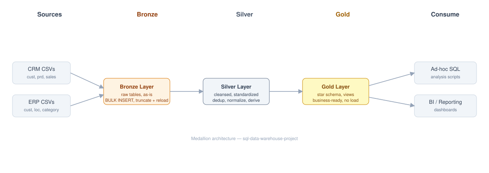

# SQL Data Warehouse Project

A hands-on data warehousing project built with Microsoft SQL Server, implementing the **Medallion Architecture** (Bronze → Silver → Gold) to turn raw CRM/ERP CSV extracts into a business-ready star schema.

> **macOS + Docker users:** Start with [MAC_DOCKER_SETUP.md](MAC_DOCKER_SETUP.md) for the Docker-based setup used to build and run this project.

---
## 🏗️ Data Architecture

The data architecture follows the Medallion pattern across **Bronze**, **Silver**, and **Gold** layers:


See also: [docs/data_flow.svg](docs/data_flow.svg) (table-level lineage) and [docs/data_model.svg](docs/data_model.svg) (Gold layer star schema).

1. **Bronze Layer**: Raw data loaded as-is from source CSV files into SQL Server via `BULK INSERT`.
2. **Silver Layer**: Cleansed, standardized, and deduplicated data ready for modeling.
3. **Gold Layer**: Business-ready star schema (fact + dimension views) for reporting and analytics.

---
## 📖 Project Overview

This project covers:

1. **Data Architecture** — a modern data warehouse using the Bronze/Silver/Gold pattern.
2. **ETL Pipelines** — extracting, transforming, and loading data from source systems into the warehouse.
3. **Data Modeling** — fact and dimension tables (star schema) optimized for analytical queries.
4. **Data Quality** — automated checks validating referential integrity and key uniqueness across layers.

### Specifications
- **Data Sources**: Two source systems (ERP and CRM), provided as CSV files.
- **Data Quality**: Cleansing and resolving quality issues before modeling (see `tests/`).
- **Integration**: Both sources combined into a single, analysis-friendly data model.
- **Scope**: Latest snapshot only; historization was out of scope.

---

## 🚀 Setup & Running Order

See [MAC_DOCKER_SETUP.md](MAC_DOCKER_SETUP.md) for the full Docker-based walkthrough. In short, run:

1. `scripts/init_database.sql`
2. `scripts/ddl_load_audit.sql`
3. `scripts/bronze/ddl_bronze.sql`
4. `scripts/bronze/proc_load_bronze.sql`, then `EXEC bronze.load_bronze;`
5. `scripts/silver/ddl_silver.sql`
6. `scripts/silver/proc_load_silver.sql`, then `EXEC silver.load_silver;`
7. `tests/quality_checks_silver.sql`
8. `scripts/gold/ddl_gold.sql`
9. `tests/quality_checks_gold.sql`
10. `tests/setup_verification.sql`

---

## 🛠️ What I fixed getting this running on macOS/Docker

The course targets SQL Server on Windows. Getting it running cleanly on SQL Server for Linux (via Docker on a Mac) surfaced a few real bugs worth documenting:

- **Unsupported `BULK INSERT` option**: `CODEPAGE = '65001'` is not supported by SQL Server on Linux at all (regardless of value) — removed it from all six `BULK INSERT` calls in `proc_load_bronze.sql`.
- **T-SQL syntax gotcha**: the statement immediately before a `THROW;` must end with a semicolon, or you get `Incorrect syntax near 'THROW'`. A missing semicolon in the `CATCH` blocks of both `proc_load_bronze.sql` and `proc_load_silver.sql` silently broke procedure creation.
- **Docker parallel-query hang**: small `GROUP BY` queries against the Gold layer views would hang indefinitely with a `CXCONSUMER` wait — SQL Server picking a parallel plan that the Docker Desktop VM's scheduler never resolves. Fixed by setting `max degree of parallelism = 1` on the instance (appropriate anyway for a small dev/learning workload).
- File paths, line endings (CRLF → LF), and ERP filename casing were also adjusted for the Linux/Docker environment.

## ✅ What I added on top of the course

- **Load audit table** (`scripts/ddl_load_audit.sql`, `dbo.load_audit`): the original procedures only logged progress via `PRINT` statements, which disappear once the session closes. Both `bronze.load_bronze` and `silver.load_silver` now write a row per table per run — duration, row count, and success/failure — grouped by a `run_id`, so every load is queryable after the fact instead of only visible in the console at the time. Verified working end-to-end; see `tests/setup_verification.sql` for a query against it.

---

## 📂 Repository Structure
```
sql-data-warehouse-project/
│
├── datasets/                           # Raw datasets used for the project (ERP and CRM data)
│
├── docs/                               # Project documentation and architecture details (original diagrams)
│   ├── data_architecture.svg           # High-level architecture diagram
│   ├── data_catalog.md                 # Catalog of datasets, including field descriptions and metadata
│   ├── data_flow.svg                   # Table-level data lineage diagram
│   ├── data_model.svg                  # Gold layer star schema diagram
│   ├── naming_conventions.md           # Naming guidelines for tables, columns, and files
│
├── scripts/                            # SQL scripts for ETL and transformations
│   ├── ddl_load_audit.sql              # Load audit table (added on top of the course)
│   ├── bronze/                         # Scripts for extracting and loading raw data
│   ├── silver/                         # Scripts for cleaning and transforming data
│   ├── gold/                           # Scripts for creating analytical models
│
├── tests/                              # Data quality checks and setup verification
│
├── README.md                           # Project overview and instructions
├── MAC_DOCKER_SETUP.md                 # macOS + Docker setup guide
├── mac-docker-copy-data.sh             # Helper script to copy datasets into the Docker container
└── LICENSE                             # License information for the repository
```
---

## 🛡️ License & Credits

This project was built while working through the free **SQL Data Warehouse** course by **Data With Baraa**. The original course materials (datasets, base script structure, and course design) are © Baraa Khatib Salkini and licensed under MIT — see [LICENSE](LICENSE).

This repository is my own implementation: I wrote/ran every script myself, adapted the whole pipeline to run on SQL Server for Linux via Docker on macOS, and diagnosed and fixed the three bugs documented above that the original Windows-targeted scripts didn't need to handle.
